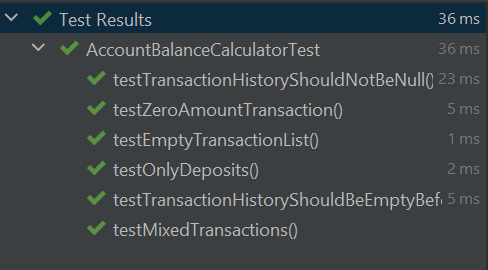
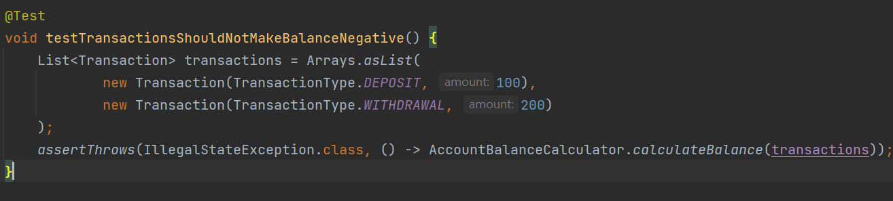
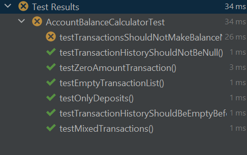
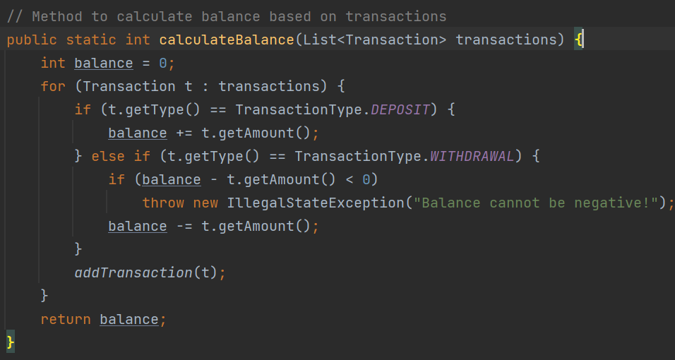
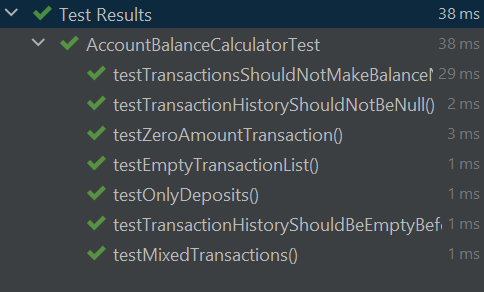
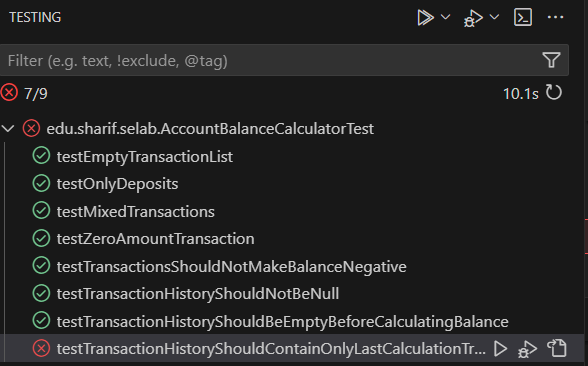
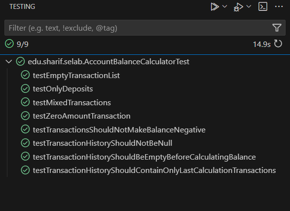

# software-lab-3

# بخش اول - کشف خطا

ابتدا با اجرای تست های همه ی تست ها پاس می شوند:



## پرسش اول

پس از بررسی کد متوجه شدیم که در اجرای تابع محاسبه موجودی، توجهی به منفی شدن موجودی نمی شود و ممکن است موجودی حساب پس از چند تراکنش کمتر از صفر شود و به این نکته توجهی نشده است.

## پرسش دوم

برای این مشکل، تست زیر را می نویسیم (فرض می کنیم در برنامه درست اگر مقدار موجودی در هر زمان منفی شد برنامه `exception` می دهد.



در تصویر زیر مشاهده می کنیم که این تست پاس نشده است:



حال کد را به صورت زیر تغییر می دهیم تا این مشکل حل شود:



و مشاهده می کنیم که همه تست ها پاس می شوند:



## پرسش سوم

نوشتن تست بعد از نوشتن برنامه ممکن ایجاد بایاس ذهنی کند و تنها تست هایی نوشته شود که برنامه در آن ها درست کار می کند. همچنین پیش فرض های مسئله ممکن است در پیاده سازی فراموش شوند چون در زمان کد زدن به حالت های خاص توجه نمی کنیم.


# بخش دوم - به کارگیری TDD

## پاس کردن تست های اول و دوم 

با صدا زدن متد
addTransaction
در متد
calculateBalance
مشکلات تست های کامنت شده اول و دوم رفع شدند، چرا که قبل از ویزایش تراکنش ها در history ثبت نمیشدند.

## پاس کردن تست سوم

تست سوم را از حالت کامنت خارج و تست ها را اجرا کردیم. مشاهده می شود که تست آخر fail می شود: 





### علت شکست تست:
این تست انتظار دارد که تاریخچه‌ ی تراکنش‌ ها فقط شامل آخرین مجموعه تراکنش‌ هایی باشد که به متد `(...)calculateBalance` داده شده‌اند. اما در پیاده‌ سازی اولیه، لیست `transactionHistory` به صورت  accumulative پر می‌ شد و تراکنش‌ های قبلی در آن باقی می‌ ماندند. در واقع تست `testTransactionHistoryShouldContainOnlyLastCalculationTransactions` انتظار دارد که وقتی متد `()calculateBalance` فراخوانی می‌ شود، نه‌ تنها موجودی صحیح بازگردانده شود، بلکه **تراکنش‌های ورودی نیز در تاریخچه‌ی تراکنش‌ها ثبت شوند**.

با بررسی فایل `AccountBalanceCalculator.java` مشخص شد که متد `()calculateBalance` فقط عملیات محاسبه‌ی موجودی را انجام می‌دهد و **تاریخچه‌ی تراکنش‌ها را به‌روزرسانی نمی‌کند**.

---

##  مرحله دوم: اصلاح کد

برای رفع این مشکل، در ابتدای متد `(...)calculateBalance`، لیست `transactionHistory` را پاک کردیم تا فقط تراکنش‌ های مربوط به محاسبه‌ ی فعلی در آن باقی بمانند. با اعمال این تغییر، هر بار که `()calculateBalance`  فراخوانی می‌شود، تاریخچه‌ی قبلی پاک شده و فقط تراکنش‌های مربوط به محاسبه‌ی فعلی در تاریخچه ثبت می‌شوند.

این دقیقاً رفتاری است که تست انتظار آن را دارد و باعث پاس شدن تست می‌شود.


###  تغییرات اعمال‌ شده در `AccountBalanceCalculator.java`:


```java
public static int calculateBalance(List<Transaction> transactions) {
    
     clearTransactionHistory(); 

    int balance = 0;
    for (Transaction t : transactions) {

        if (t.getType() == TransactionType.DEPOSIT) {
            balance += t.getAmount();
        } else if (t.getType() == TransactionType.WITHDRAWAL) {
            if (balance - t.getAmount() < 0)
                throw new IllegalStateException("Balance cannot be negative!");
            balance -= t.getAmount();
        }
        addTransaction(t);
    }
    return balance;
}
```


### اجرا مجدد تست ها :


مجددا تست ها را ران می کنیم و مشاهده می شود که تست آخر این بار با اعمال تغییرات گفته شده، پاس شد.




## پرسش چهارم:

با استفاده از روش TDD (توسعه مبتنی بر آزمون) که در این پروژه به کار بردیم، نوشتن موارد آزمون قبل از کدنویسی موجب تسهیل فرآیند ساخت برنامه در چندین جنبه شد.

شفاف‌ سازی نیازمندی‌ ها: قبل از اینکه حتی یک خط کد بنویسیم، آزمون‌ها دقیقا مشخص کردند که برنامه باید چه ویژگی‌هایی داشته باشد. برای مثال، یکی از نیازهای اصلی این بود که تاریخچه تراکنش‌ها باید به‌ درستی مدیریت شود و پس از هر فراخوانی متد calculateBalance فقط تراکنش‌های مربوط به آن فراخوانی در تاریخچه ثبت شوند. این آزمون‌ ها ما را مجبور به طراحی کدی کردند که دقیقا این ویژگی‌ ها را پیاده‌ سازی کند.

تمرکز بر اهداف: نوشتن آزمون‌ ها پیش از کدنویسی باعث شد که کدنویسی تنها در راستای پاسخگویی به نیازهای آزمون‌ ها باشد. این رویکرد مانع از انحراف به سمت ویژگی‌ های اضافی یا طراحی پیچیده شد. با تمرکز بر نوشتن کد فقط برای پاس کردن تست‌ها، مطمئن شدیم که هیچ بخش غیرضروری به برنامه اضافه نمی‌ شود.

کاهش زمان اشکال‌زدایی: با استفاده از TDD، هر زمان که تغییراتی در کد اعمال می‌کردیم، به‌ طور همزمان آزمون‌ ها را اجرا می‌کردیم تا اطمینان حاصل کنیم که کد به درستی عمل می‌کند. این باعث شد که مشکلات به سرعت شناسایی و رفع شوند و نیازی به اشکال‌ زدایی‌های پیچیده در مراحل نهایی پروژه نداشتیم.


## پرسش پنجم:

### مزایا:

شناسایی سریع‌تر خطاها: همان‌ طور که در این پروژه مشاهده شد، با نوشتن تست‌ها پیش از کدنویسی، خطاها و مشکلاتی مانند عدم مدیریت تراکنش‌های منفی در ابتدا شناسایی شدند. این کار باعث می‌ شود که خطاها در مراحل ابتدایی توسعه شناسایی شوند، نه پس از تکمیل پروژه.

کاهش پیچیدگی در برنامه‌نویسی: با استفاده از TDD، تنها کدی نوشته می‌شود که به‌طور دقیق نیازمند پاس کردن تست‌ ها است. این فرآیند از پیچیدگی‌ های غیرضروری در کد جلوگیری می‌ کند و کد را ساده‌تر و نگهداری آن را راحت‌ تر می‌کند.


### معایب:

امکان عدم پوشش تمام حالات: یکی از مشکلاتی که در TDD ممکن است رخ دهد این است که آزمون‌ها ممکن است تمام شرایط خاص و موارد غیرمنتظره را پوشش ندهند، به ویژه اگر تست‌ ها به‌ طور کامل و دقیق طراحی نشده باشند.

نیاز به زمان بیشتر در ابتدا: نوشتن تست‌ها قبل از کدنویسی در ابتدا ممکن است زمان‌بر باشد و ممکن است به نظر برسد که این کار سرعت کدنویسی را کاهش می‌دهد. در پروژه‌های بزرگ، نوشتن تست‌ها می‌تواند زمان زیادی بگیرد.

وابستگی زیاد به تست‌ ها: اگر تست‌ها به‌درستی طراحی نشوند یا به روز رسانی نشوند، ممکن است به کد هایی اعتماد کنیم که در واقعیت مشکلاتی دارند. در این پروژه، اگر تست‌ ها به‌ طور کامل طراحی نمی‌ شدند، ممکن بود که برخی از مشکلات خاص (مثل تاریخچه تراکنش‌ ها) نادیده گرفته شوند.

