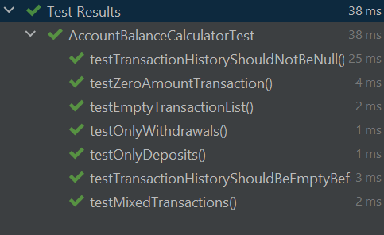
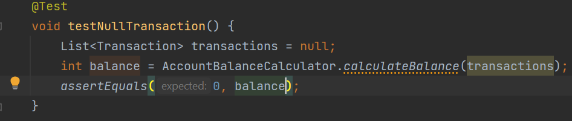
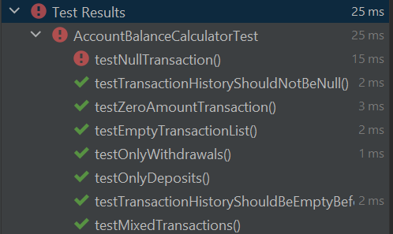
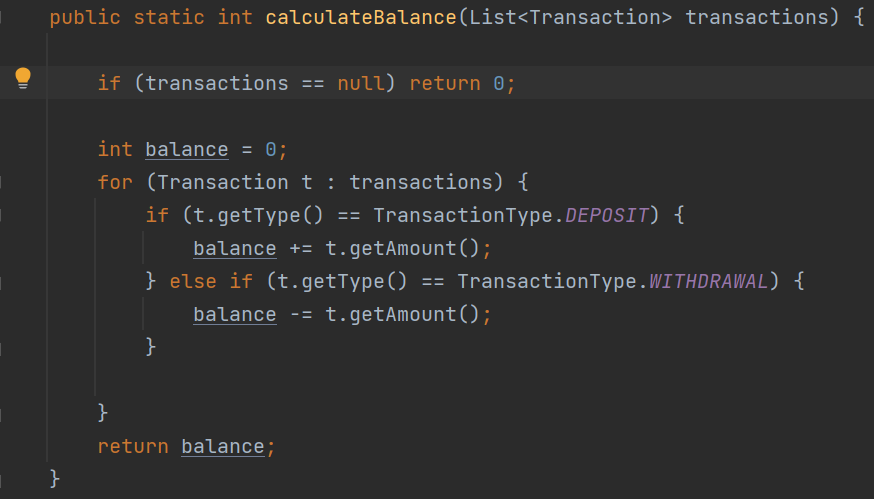
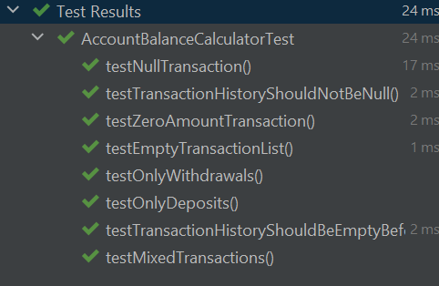

# software-lab-3

# بخش اول - کشف خطا

ابتدا با اجرای تست های همه ی تست ها پاس می شوند:

## پرسش اول

پس از بررسی کد متوجه شدیم در صورتی که مقدار `null` را به عنوان ورودی متد `calculateBalance` بدهیم برنامه به مشکل می خورد. دلیل نادیده گرفته شدن این موضوع داشتن پیش فرض ذهنی معتبر بودن ورودی می باشد و به این حالت خاص توجهی نشده است.

## پرسش دوم

برای این مشکل، تست زیر را می نویسیم (فرض می کنیم در برنامه درست اگر ورودی `null` باشد خروجی باید صفر باشد) :

در تصویر زیر مشاهده می کنیم که این تست پاس نشده است:

حال کد را به صورت زیر تغییر می دهیم تا این مشکل حل شود:

و مشاهده می کنیم که همه تست ها پاس می شوند:

## پرسش سوم

نوشتن تست بعد از نوشتن برنامه ممکن ایجاد بایاس ذهنی کند و تنها تست هایی نوشته شود که برنامه در آن ها درست کار می کند. همچنین پیش فرض های زمان کد زدن ( مانند فرض تهی نبودن ورودی توابع) باعث می شود فراموش کنیم تا حالت های خاص و نادر را چک کنیم.